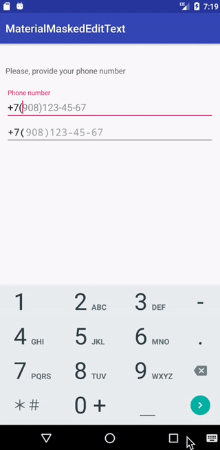

# MaterialMaskedEditText
Android edit text with masking features and material design

This project is built around [egslava/edittext-mask](https://github.com/egslava/edittext-mask). That edittext is wrapped in a TextInputLayout 
with slight modifications in order to combine the features of the masked edit text and and the text input 
layout in a more user friendly way.

## Usage
Add _xmlns:mask="http://schemas.android.com/apk/res-auto"_ to your layout xml root:

    <com.snehi.materialmaskededittext.MaterialMaskedEditText
        android:id="@+id/test"
        android:layout_width="match_parent"
        android:layout_height="wrap_content"
        android:inputType="phone"
        mask:allowed_chars="1234567890"
        android:hint="Floating Label Text"
        mask:keep_mask_hint="true"
        mask:mask="+7(###)###-##-##"
        mask:mask_hint="9081234567"/>
        
        
Where _mask_ is the input mask you want and '#' is an editable position (will be replaced by a whitespace on screen).
Use `mask:keep_mask_hint` in order to maintain the hint appearance while the edit text is active

You can optionally set the representation character (in case you don't want to use '#'):

    <com.snehi.materialmaskededittext.MaterialMaskedEditText
        android:id="@+id/test"
        android:layout_width="match_parent"
        android:layout_height="wrap_content"
        android:inputType="phone"
        mask:allowed_chars="1234567890"
        android:hint="Floating Label Text"
        mask:keep_mask_hint="true"
        mask:char_representation="c"
        mask:mask="+7(ccc)ccc-cc-cc"
        mask:mask_hint="9081234567"/>
        
 The component extends [TextInputLayout](https://developer.android.com/reference/android/support/design/widget/TextInputLayout) so those attributes and methods still apply including styling. Use
 `android:hint` to set the floating hint text and use `mask:keep_floating_hint` to maintain the floating
 hint text while the edit text is inactive
 

## Methods

|Method | type | functionality|
| --- | --- | --- |
|`setOnEditorActionListener` | *TextView.OnEditorActionListener* | set an editor action lister directly on the edit text|
|`setTextWatcher` | *TextWatcher* | maintain the floating hint text while the edit text is inactive|
|`setFloatingHintText`| *String* | set the floating text via the TextInputLayout
|`setFloatingHintEnabled`| *boolean* | set whether the floating text is shown or not
|`setText`| *String* | set the text on the edit text
|`getText`| *String* | get the text on the edit text including the mask template
|`setMask`| *String* | set the mask pattern on the edit text
|`getMask`| *String* | get the mask pattern of the edit text
|`getRawText`| *String* | get the text on the edit text **NOT** including the mask template
|`setCharRepresentation`| *char* | set the *char* that is used in the mask pattern
|`getCharRepresentation`| *char* | get the *char* that is used in the mask pattern
|`setHintText`| *String* | set the hint (mask hint) on the edit text
|`getHintText`| *CharSequence* | get the hint (mask hint) on the edit text
|`setKeepMaskHint`| *boolean* | set to keep the input hint while the edit text is active
|`setKeepFloatingText`| *boolean* | set to keep the floating hint text while the edit text is inactive
|`setMaxLength`| *int* | set a max number of characters on the edit text
|`setAllowedCharacters`| *String* | set the characters that are allowed to be used in the edit text ex. "0123456789"
|`getAllowedCharacters`| *String* | get the allowed characters
|`setDeniedCharacters`| *String* | set the characters that are **NOT** allowed to be used in the edit text ex. "0123456789"
|`getDeniedCharacters`| *String* | get the denied characters
|`setInputType`| *String* | set the input type on the edit text
	
